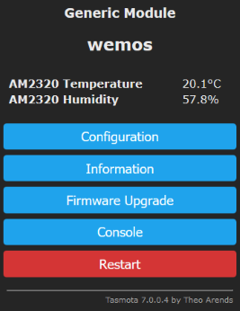

# AM2320 driver for Tasmota

This is an user defined driver for [Tasmota](https://github.com/arendst/Tasmota/) to support the cheap I2C temperature/humidity sensor [AM2320](https://akizukidenshi.com/download/ds/aosong/AM2320.pdf). 

Just drop the driver file into the `tasmota` subdirectory of your copy of Tasmota, add a `#define USE_AM2320` preprocessor statement to your `my_user_config.h` right below the `#ifdef USE_I2C` statement around line 370. Recompile Tasmota, flash your device and configure two GPIOs (SDA/SCL) for I2C use the Tasmota WebUI. If you use the TX/RX pins on your Tasmota device (not recommended) make sure you have serial logging disabled (enter `SerialLog off` in Tasmota console). Tested with Tasmota 9.2.0.2.

 &nbsp; &nbsp; &nbsp; &nbsp; &nbsp; &nbsp; 

When you connect the AM2320 sensor to the SDA/SCL pins of your Tasmota device make sure to include 4.7k pull-up resistors from VCC to SDA and from VCC to SDL or I2C communication might not work as expected. If you've already connected another I2C device on a breakout board to the I2C bus you can probably skip the pull-up resistors since these are usually provided on a sensor breakout board.
